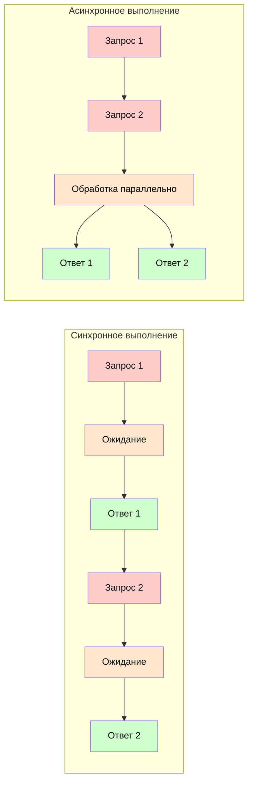

# Синхронное и асинхронное программирование
## Введение

Синхронное и асинхронное программирование представляют собой два фундаментально разных подхода к выполнению операций в программе. Давайте разберем их различия и особенности использования.

## Основные концепты

| Характеристика | Синхронный подход | Асинхронный подход |
| --- | --- | --- |
| Выполнение операций | Последовательное, блокирующее | Параллельное, неблокирующее |
| Обработка задержек | Ожидание завершения | Продолжение работы |
| Использование ресурсов | Монопольный доступ | Эффективное распределение |
| Ответственность кода | Линейная последовательность | Управление состоянием |

## Визуальное сравнение



На диаграмме показано:
- 🔴 Красным цветом отмечены запросы
- 🟠 Оранжевым показаны периоды ожидания
- 🟢 Зелёным выделены полученные ответы

В синхронном варианте каждая операция ждёт завершения предыдущей, создавая очередь выполнения. В асинхронном варианте запросы отправляются сразу, а их обработка происходит параллельно.

## Практические примеры

### Синхронный подход
```javascript
function processData() {
    const data1 = fetchDataFromDB();     // Блокирует выполнение
    console.log('Данные 1 получены');
    
    const data2 = fetchDataFromFile();   // Ждёт завершения предыдущей операции
    console.log('Данные 2 получены');
    
    return combineData(data1, data2);    // Выполняется последним
}

const result = processData();
console.log(result);
```

### Асинхронный подход
```javascript
async function processData() {
    const [data1, data2] = await Promise.all([
        fetchDataFromDB(),
        fetchDataFromFile()
    ]);
    
    console.log('Все данные получены');
    return combineData(data1, data2);
}

processData().then(result => {
    console.log(result);
});
```

## Когда какой подход выбирать

### Синхронный подход подходит когда:
- Операции простые и быстрые
- Последовательность выполнения критична
- Работаете с небольшим объёмом данных
- Нужна максимальная простота кода

### Асинхронный подход подходит когда:
- Есть операции с ожиданием (сеть, база данных)
- Необходимо выполнять несколько задач параллельно
- Важна производительность приложения
- Работаете с большими данными или внешними сервисами

## Рекомендации по использованию

1. В современных веб-приложениях предпочтительнее использовать асинхронное программирование для работы с сетью и базами данных
2. Для простых операций допустимо использовать синхронный подход
3. При работе с файловой системой учитывайте специфику операционной системы
4. Всегда обрабатывайте ошибки как в синхронном, так и в асинхронном коде

## Заключение

Выбор между синхронным и асинхронным подходом зависит от конкретных требований вашего проекта. Асинхронное программирование предоставляет больше возможностей для оптимизации производительности, но требует более тщательного планирования архитектуры приложения.
